# **2° TRABAJO PRACTICO**

La siguiente API se encargara de la administracion de una empresa, realizando un ABM(alta,baja, modificacion) sobre una base de datos que cuenta con dos tablas, una sobre de departamentos y la otra sobre empleados

**Importante** para poder trabajar correctamente con el proyecto clonar el mismo **NO** descargar el .zip

### **CREACION DE LA BASE DE DATOS**

La script para poder armar la base de datos en MYSQL junto con las tablas de Departamentos y Empleados se encuentra integrada en el archivo con el nombre de --> 'empresautn_Parcial'

Ejecutar los siguientes script: 

```bash 
  CREATE DATABASE empresautn;
```

```bash
  USE empresautn;
```

```bash
  CREATE TABLE `empresautn`.`departamentos` (
  `idDepartamento` INT NOT NULL AUTO_INCREMENT,
  `Area` VARCHAR(25) NOT NULL,
  `Es_Remoto` TINYINT NOT NULL DEFAULT 0,
  `Director` VARCHAR(50) NOT NULL,
  `Presupuesto` DECIMAL(10,2) NOT NULL,
  `Cant_Empleados` INT NOT NULL,
  `createdAt` DATE NULL DEFAULT NULL,
  `updatedAt` DATE NULL DEFAULT NULL,
  PRIMARY KEY (`idDepartamento`)
);
```

```bash
  CREATE TABLE `empresautn`.`empleados` (
  `idEmpleado` INT NOT NULL AUTO_INCREMENT, 
  `idDepartamento` INT NULL DEFAULT NULL,
  `Nombre` VARCHAR(45) NOT NULL,
  `Apellido` VARCHAR(45) NOT NULL,
  `Salario` DECIMAL(10,2) NOT NULL,
  `Dias_Vacaciones` INT NOT NULL,
  `Estado` TINYINT NOT NULL DEFAULT 0,
  `Categoria` VARCHAR(15) NOT NULL,
  `createdAt` DATE NULL DEFAULT NULL,
  `updatedAt` DATE NULL DEFAULT NULL,
  PRIMARY KEY (`idEmpleado`),
  -- RELACION DE 1:N EN DONDE EL 1 ES EL DEPARTAMENTO Y N POR EMPLEADOS
  FOREIGN KEY (`idDepartamento`) REFERENCES departamentos(`idDepartamento`)  
);
```

### **HABILITACION DE PUERTOS POR XAMPP**

- Antes de arrancar el programa se debe asegurar que la conexion por el port 3306 este habilitado como se lo ve en la siguiente imagen:

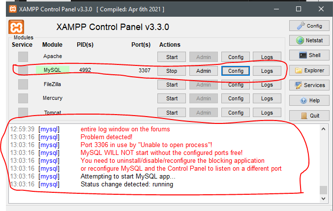


### **INSTALACION DE MODULOS**

1) Al tener ya el programa, el primer paso pasa por instalar los modulos necesarios para trabajar con el proyecto, colocar el siguiente comando en consola bash


```bash
  npm i
```

2) Lo segundo pasa por arrancar el programa en consola bash, colocar lo siguiente:

```bash
  nodemon app.js
```
 - En caso de tener problemas con nodemon instalarlo de forma global con:

   ```bash
  npm install -g nodemon
  ```

3) Si en consola bash llega aparecer el siguiento texto signigica que la conexion ha sido 'exitosa' de lo contrario revisar los puertos en el archivo .env en del proyecto

```bash
[nodemon] 3.1.7
[nodemon] to restart at any time, enter `rs`
[nodemon] watching path(s): *.*
[nodemon] watching extensions: js,mjs,cjs,json
[nodemon] starting `node app.js`
Servidor corriendo en http://localhost:3030
Executing (default): SELECT 1+1 AS result
Conexión a la base de datos establecida correctamente. 
```

## **METODOS HTTP**

Para poder trabajar con la api utilizaremos endpoinst, ya sea que se trabaje con Thunder Client o Postman, estos seran los siguientes paths para que se ejecuten una funcion **(se adjuntaron varios datos en formato JSON para probar los ingresos en el archivo 'datosDepartamentos.json' y 'datosEmpleados.json')**

### DEPARTAMENTOS

1) **POST** esto creara un nuevo departamento, los datos a usar seran:

  ```bash 
  {
    "Area": "...", // STRING - pueden ser marketing, ventas, desarrollo, etc
    "Es_Remoto": false, // TRUE/FALSE - si el trabajo es remoto puede ser false o true
    "Director": "...", // STRING - el nombre completo de la persona a cargo
    "Presupuesto": 0, // DECIAMAL(10, 2)presupuesto del departamento
    "Cant_Empleados": 0 // INT cantidad de empleados
  }
  ```
  
 -  ```bash 
    POST > http://localhost:3030/departamentos
    ```

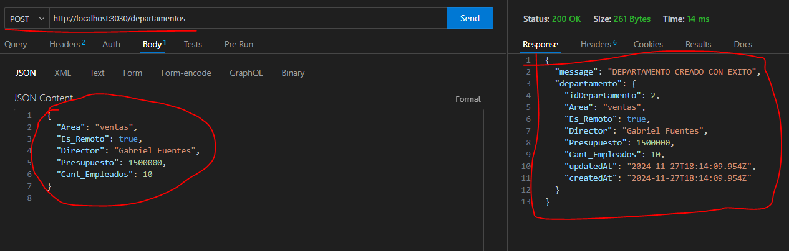

2) **GET** la primera opcion traera todos los departamentos y el otro traera un departamento por su id

    
- ```bash 
  GET > http://localhost:3030/departamentos
  ```

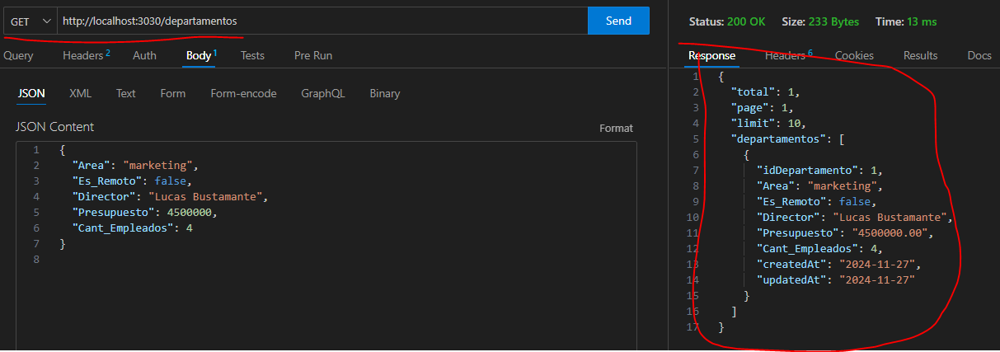


- ```bash 
  GET > http://localhost:3030/departamentos/'idDepartamento'
  ```

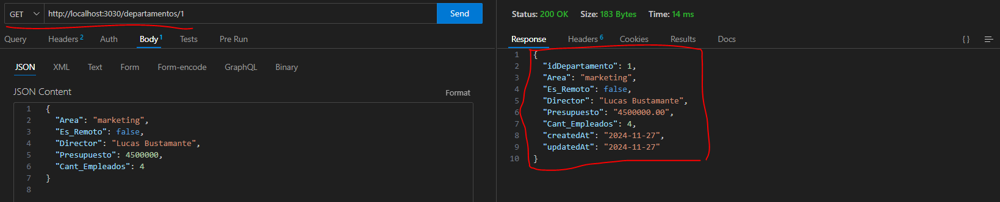


3) **PUT** esto actualizara un solo dato o varios a la vez sobre un departamento el cual pasaremos su id como parametro por el path 

  - ```bash 
    PUT > http://localhost:3030/departamentos/'idDepartamento'
    ```

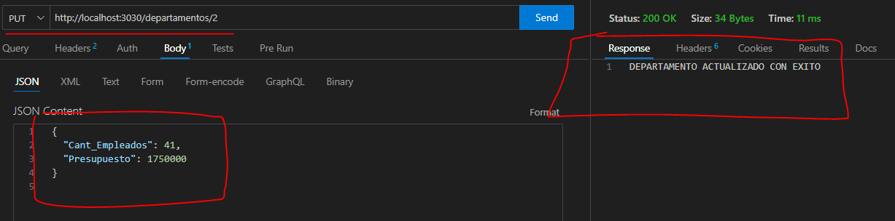

4) **DELETE** esto eliminara un solo departamento pasandole su id en el path

  - ```bash 
    DELETE > http://localhost:3030/departamentos/'idDepartamento'
    ```

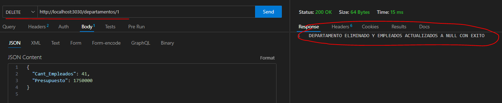

### EMPLEADOS 

1) **POST** esto creara un empleado con los siguientes datos:

```bash
  {
    "Nombre": "...", // STRING
    "Apellido": "...", // STRING
    "Salario": 0, // DECIMAL(10, 2)
    "Dias_Vacaciones": 0, // INT
    "Estado": true, // TRUE/FALSE - si esta de vacaciones o no
    "Categoria": "...", // STRING - junior, semi-senior, senior
    "idDepartamento": 2 //esto es opcional si no se agrega sera null y no hay relacion 1:N
  }
```

-  ```bash 
    POST > http://localhost:3030/empleados
    ```

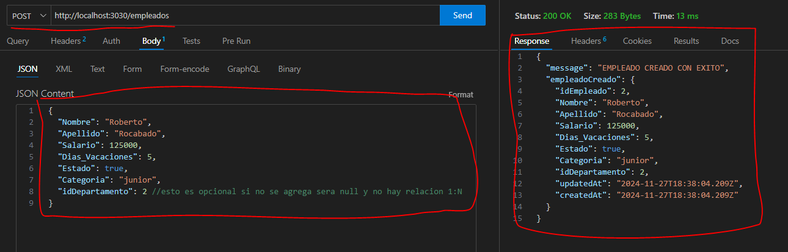


2) **GET** la primera opcion traera todos los empleados y el otro traera un empleado por su id

- ```bash 
  GET > http://localhost:3030/empleados
  ```

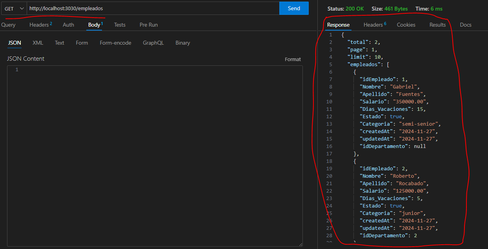


- ```bash 
  GET > http://localhost:3030/empleados/'idEmpleado'
  ```

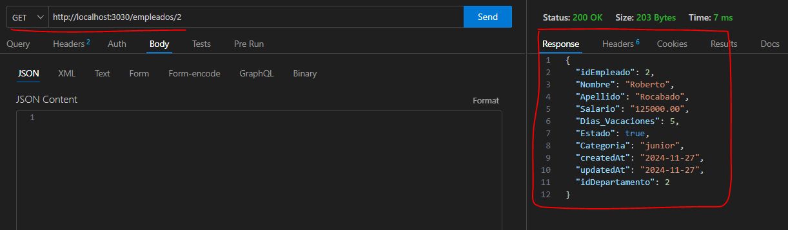

3) **PUT** esto actualizara un solo dato o varios a la vez sobre un empleado el cual pasaremos su id como parametro por el path 

  - ```bash 
    PUT > http://localhost:3030/empleados/'idEmpleado'
    ```

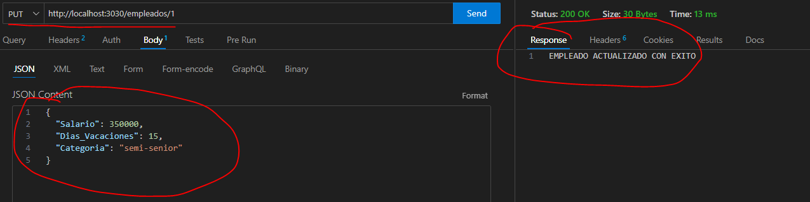

4) **DELETE** esto eliminara un solo empleado pasandole su id en el path

  - ```bash 
    DELETE > http://localhost:3030/empleados/'idEmpleado'
    ```

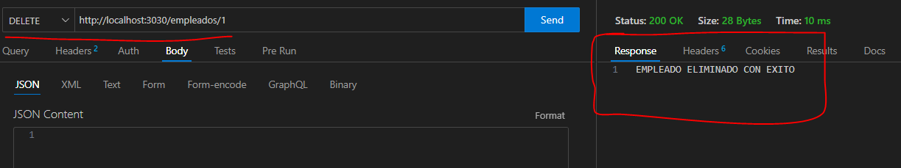

## BUSQUEDAS CON PARAMETROS

### DEPARTAMENTOS

Esto devolvera una lista parametrizada de los departamentos

- ```bash
  GET > http://localhost:3030/departamentos?page=1&limit=2&sort=DESC&es_Remoto=false
  ```

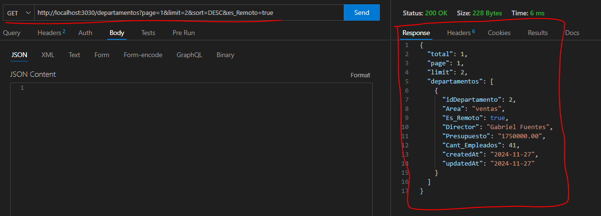


### EMPLEADOS

- ```bash
  GET > http://localhost:3030/empleados?page=1&limit=5&sort=ASC&categoria=junior&estado=true
  ```

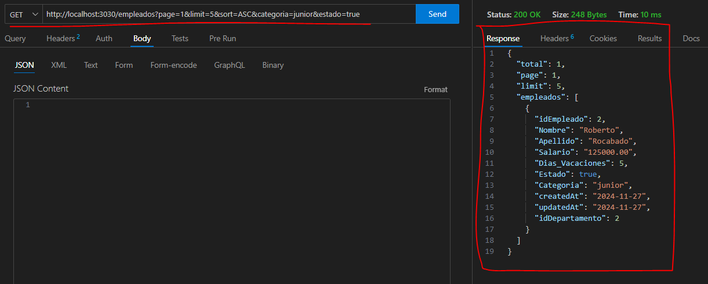


## **Relacion 1:N**

La relacion es de **UN** departamento por **MUCHOS** empleados
